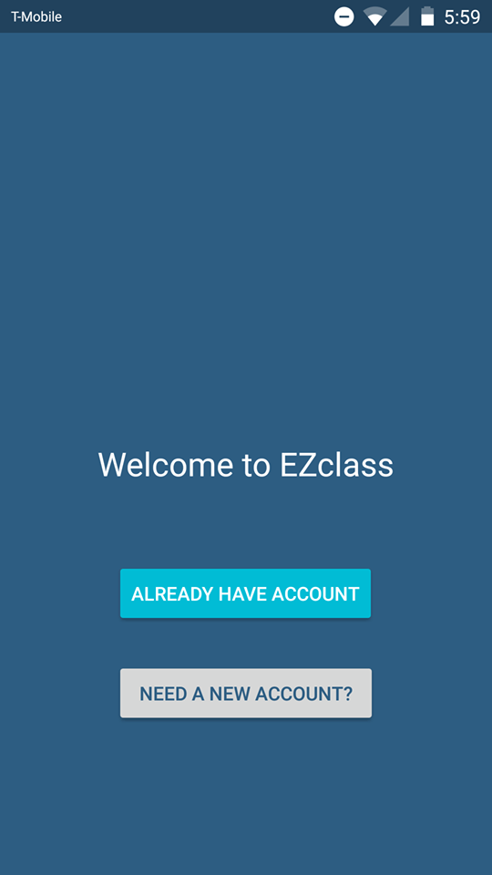
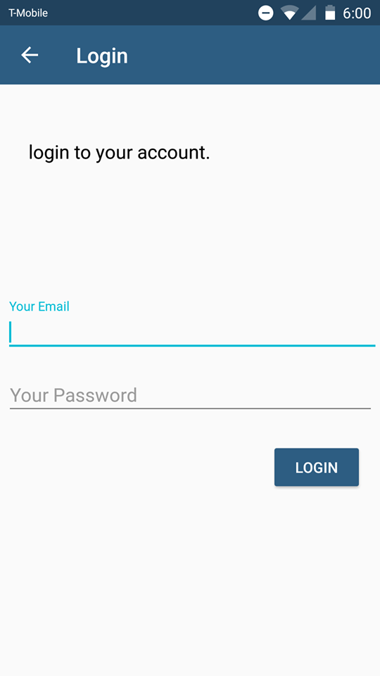
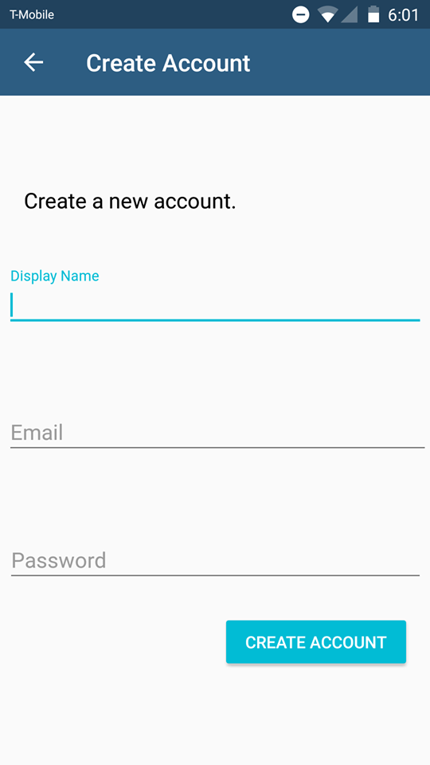
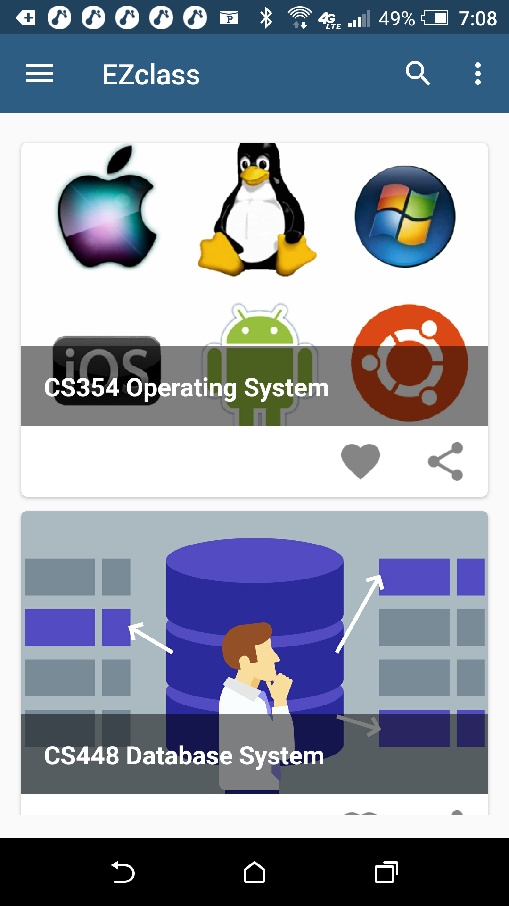
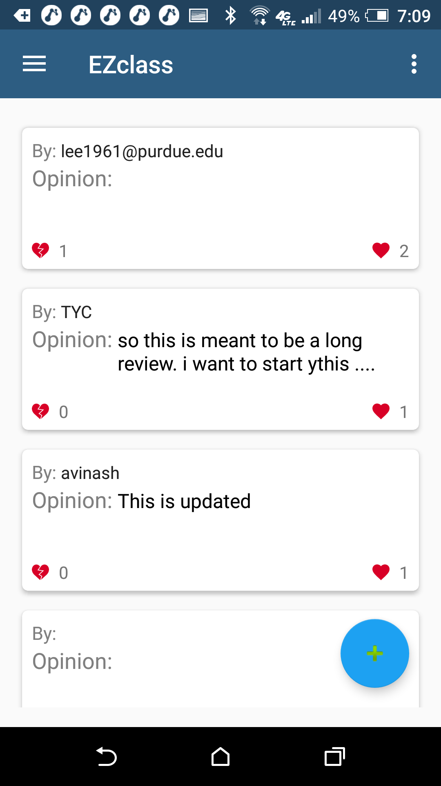
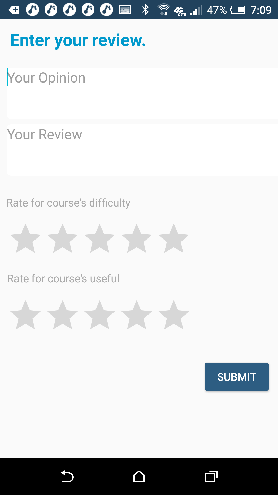

# DOCUMENTATION
## EZClassApp

Students who have not taken a class before and have no idea how hard or how to succeed in the class can use this this Android app to gain more insight about a class.

## DESCRIPTION
A color picker tool programmed in Java.

## START PAGE

## Login Page

## Create an Accout Page

## Main Page

## List of Review Page

## Submit form Review Page

## CONTACT
If you would like the apk file, you can contact me at lee1961@purdue.edu
